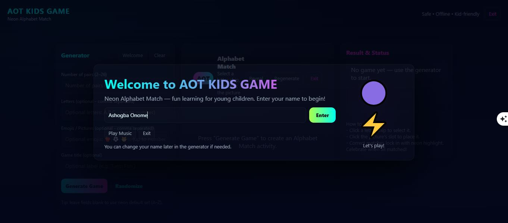
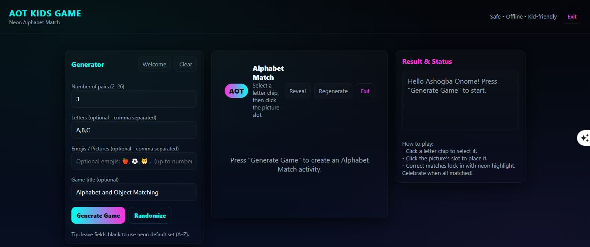
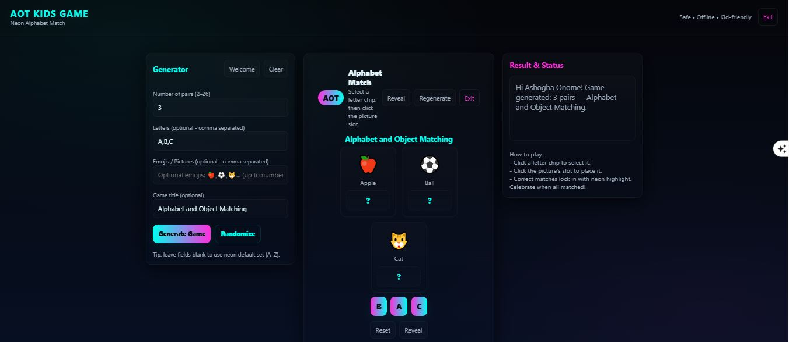
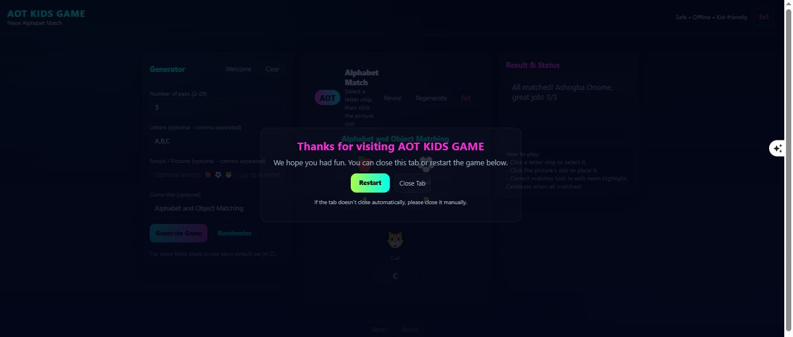

  

<h1 align="center">AOT Kids Learning Game</h1>

An AI-assisted educational browser game designed to make learning fun for children through an interactive alphabet matching experience.

---

## Live Demo

**Play the Game**

🔗 https://ashogbaonome.github.io/aot-kids-learning-game/

---

## Features

- Interactive alphabet matching
- Child-friendly interface
- Neon modern design
- Responsive layout
- AI-assisted development
- Works directly in the browser

---

## Technologies Used

- HTML5
- CSS3
- JavaScript
- GitHub Pages

---

## Screenshots

### Welcome Screen

---

### Main Game

---

### Gameplay

---

### Completed Game

---

## Author

**Ashogba Onome**

Founder, **AOT (Ashogba Onome Technology)**

---

## Future Improvements

- Multiple difficulty levels
- More educational categories
- Sound effects
- Leaderboard and score tracking
- Mobile optimization
- Additional educational themes

---

## License

This project is licensed under the MIT License.
